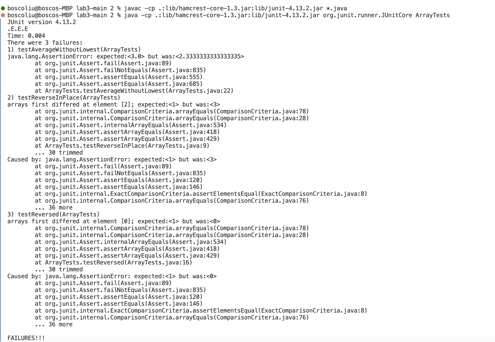
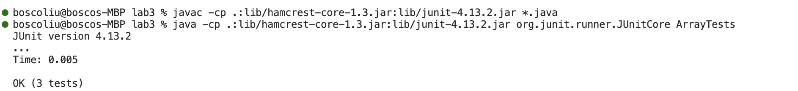

# Lab Report 3 - Bugs and Commands (Week 5)
## Part 1 - Bugs

**Array Methods: "Reverse Methods"**

#### A failure-inducing input
```

	@Test 
	public void testReverseInPlace() {
    int[] input1 = { 1, 2, 3 };
    ArrayExamples.reverseInPlace(input1);
    assertArrayEquals(new int[]{ 3, 2, 1 }, input1);
	}


  @Test
  public void testReversed() {
    int[] input1 = { 3, 2, 1 };
    assertArrayEquals(new int[]{ 1, 2, 3 }, ArrayExamples.reversed(input1));
  }

  @Test
  public void testAverageWithoutLowest(){
    double[] input1 = {2.0 ,1.0, 3.0, 4.0};
    assertEquals(3.0, ArrayExamples.averageWithoutLowest(input1), 0.0001);
  }

```
#### An input that doesn't induce a failure
```

	@Test 
	public void testReverseInPlace() {
    int[] input1 = { 3 };
    ArrayExamples.reverseInPlace(input1);
    assertArrayEquals(new int[]{ 3 }, input1);
	}


  @Test
  public void testReversed() {
    int[] input1 = { };
    assertArrayEquals(new int[]{ }, ArrayExamples.reversed(input1));
  }

  @Test
  public void testAverageWithoutLowest(){
    double[] input1 = {1.0, 2.0, 3.0, 4.0};
    assertEquals(3.0, ArrayExamples.averageWithoutLowest(input1), 0.0001);
  }

```

## Screenshot from the two inputs
### symptom of failure inputs

### success input but has bug

### Original code
```
public class ArrayExamples {

  // Changes the input array to be in reversed order
  static void reverseInPlace(int[] arr) {
    for(int i = 0; i < arr.length; i += 1) {
      arr[i] = arr[arr.length - i - 1];
    }
  }

  // Returns a *new* array with all the elements of the input array in reversed
  // order
  static int[] reversed(int[] arr) {
    int[] newArray = new int[arr.length];
    for(int i = 0; i < arr.length; i += 1) {
      arr[i] = newArray[arr.length - i - 1];
    }
    return arr;
  }

  // Averages the numbers in the array (takes the mean), but leaves out the
  // lowest number when calculating. Returns 0 if there are no elements or just
  // 1 element in the array
  static double averageWithoutLowest(double[] arr) {
    if(arr.length < 2) { return 0.0; }
    double lowest = arr[0];
    for(double num: arr) {
      if(num < lowest) { lowest = num; }
    }
    double sum = 0;
    for(double num: arr) {
      if(num != lowest) { sum += num; }
    }
    return sum / (arr.length - 1);
  }
}
```
### after fix
```
public class ArrayExamples {

  // Changes the input array to be in reversed order
  static void reverseInPlace(int[] arr) {
    int temp;
    for(int i = 0; i < arr.length/2; i += 1) {
      temp = arr[arr.length - i - 1];
      arr[arr.length - i - 1] = arr[i];
      arr[i] = temp;
    }
  }

  // Returns a *new* array with all the elements of the input array in reversed
  // order
  static int[] reversed(int[] arr) {
    int[] newArray = new int[arr.length];
    for(int i = 0; i < arr.length; i += 1) {
      newArray[i] = arr[arr.length - i - 1];
    }
    return newArray;
  }

  // Averages the numbers in the array (takes the mean), but leaves out the
  // lowest number when calculating. Returns 0 if there are no elements or just
  // 1 element in the array
  static double averageWithoutLowest(double[] arr) {
    int count =  0;
    if(arr.length < 2) { return 0.0; }

    double lowest = arr[0];
    for(double num: arr) {
      if(num < lowest) { lowest = num; }
    }
    double sum = 0;
    for(double num: arr) {
      if(num == lowest && count == 0) { 
        count += 1;
       }else{
        sum += num;
       }
    }
    return sum / (arr.length - 1);
  }
} 
```
## Briefly describe why the fix addresses the issue.
1. reverseInPlace: creates "int temp" to store values; then we can swap the first and last elements without duplicating any values.
2. reversed: rearranges the old array into the new one using the back-to-front method.
3. averageWithoutLowest: just make sure the program skips the repeated lowest value by adding a count and switching only once.

## Part 2 - Researching Commands
For this task, I'll choose the `grep` command, which is a powerful tool used for searching text using patterns. Below are four interesting command-line options for grep along with examples of their use on files and directories from ./technical.
### 1. `-i` (Ignore Case)
#### Example 1: Search without caring about case
```
grep -i "problem" ./biomed/1468-6708-3-3.txt
```
#### output
```
The problem
```
Explanation: This searches for the word "problem" in config.txt under the ./technical directory, ignoring case. It's useful for finding content without worrying about whether letters are capitalized.

#### Example 2: Search in multiple files

``` grep -i "error" ./biomed/*.txt ```
#### output(since many cases output, I just pick some of them)
```
./biomed/1468-6708-3-1.txt:        different. The bars are slightly offset to permit all error
./biomed/1471-2091-3-17.txt:          inaccuracies in pH measurement produced serious errors in
./biomed/1471-2091-3-31.txt:          standard error) in six experiments, three separate
./biomed/1471-2091-3-31.txt:          Errors in molecular mass were propagated from standard
./biomed/1471-2091-3-31.txt:          coefficient measurements. To calculate error in
./biomed/1471-2091-3-31.txt:          assumption that all error in the molecular-mass
./biomed/1471-2091-3-4.txt:        S values identical, within error, to
./biomed/1471-2091-3-4.txt:          errors in metal content data reflect the standard
./biomed/1471-2091-3-4.txt:          . The reported errors reflect fitting uncertainties. All
./biomed/1471-2105-2-1.txt:          content of the site and σ is the standard error of its
./biomed/1471-2105-2-8.txt:          and, if desired, a substitution error model to deal with
./biomed/1471-2105-2-8.txt:          error-prone sequence data. The sum over all possible
./biomed/1471-2105-2-8.txt:          substitution error model applies, since otherwise each
./biomed/1471-2105-2-8.txt:            applications to error-prone sequence data (expressed
./biomed/1471-2105-2-8.txt:          scores would determine a minimum error rate area with a
./biomed/1471-2105-2-8.txt:          the results in this paper. These error rates are probably
./biomed/1471-2105-2-9.txt:          errors.
```
### 2. `-r` (Recursive)
#### Example 1: Recursively search in directories
```
grep -r "function" ./technical/

```
#### output(pick some of output)
```
./technical//biomed/1471-2121-3-25.txt:          role in the subcellular targeting and functional
./technical//biomed/1471-2121-3-25.txt:        mutations in the N(T)KxD nucleotide binding motif function
./technical//biomed/1471-2121-3-25.txt:        physiological function of Rab24. To explore this issue
./technical//biomed/1471-2121-3-25.txt:        functions as a true dominant suppressor of endogenous
./technical//biomed/1471-2121-3-25.txt:        unanticipated, since the only GTPase known to function in
./technical//biomed/1471-2121-3-25.txt:        function in autophagic degradation of misfolded proteins,
./technical//biomed/1471-2202-4-6.txt:          function of the Bio-Rad LaserSharp software (data not
./technical//biomed/1471-2202-4-6.txt:          to proliferation index as a function of days in culture
./technical//biomed/1471-2202-4-6.txt:          function of time in culture and/or culture density. This
./technical//biomed/1472-6882-1-10.txt:          nature and dioxygenated functionality [ 44 ] .
./technical//biomed/1471-2121-3-19.txt:        cellular structures to optimally perform their functions or
````
Explanation: This searches recursively for the word "function" in all files within the `./technical` directory and its subdirectories. It's useful for finding occurrences of a term across a project's files.

#### Example 2: Combine recursive search with file pattern
```
grep -r --include="*.txt" "def" ./technical/
```
#### output(some of result)
```
./technical//911report/chapter-10.txt:                every terrorist group of global reach has been found, stopped, and defeated." The
./technical//911report/chapter-10.txt:                In Phase Four, civilian and military operations turned to the indefinite task
./technical//911report/chapter-11.txt:            In late 2000, DCI GeorgeTenet recognized the deficiency of strategic analysis against
./technical//911report/chapter-11.txt:                soon it might do it. At some level that is hard to define, we believe the threat had
./technical//911report/chapter-11.txt:                months before 9/11:"It would be a mistake to redefine counterterrorism as a task of
./technical//911report/chapter-11.txt:                Atlanta Olympics. There he had tried to create an air defense plan using assets from
./technical//911report/chapter-11.txt:                indicators; and (4) adopt defenses to deflect the most dangerous possibilities or at
./technical//911report/chapter-11.txt:                defenses within an aircraft or against terroristcontrolled aircraft, suicidal or
./technical//911report/chapter-11.txt:                the systemic issues of how to strengthen the layered security defenses to protect
./technical//911report/chapter-11.txt:                aircraft against hijackings or put the adequacy of air defenses against suicide
./technical//911report/chapter-11.txt:            The U.S. policy response to al Qaeda before 9/11 was essentially defined following
./technical//911report/chapter-11.txt:                indefinite air campaign to disable that regime's limited military capabilities and
./technical//911report/chapter-11.txt:                strategy envisioned some yet undefined further role for the military in addressing
./technical//911report/chapter-11.txt:            America's homeland defenders faced outward. NORAD itself was barely able to retain
./technical//911report/chapter-11.txt:                coming from overseas. We recognize that a costly change in NORAD's defense posture
./technical//911report/chapter-11.txt:            Other agencies deferred to the FBI. In the August 6 PDB reporting to President Bush
./technical//911report/chapter-11.txt:                mission by defining away the hardest part of their job. They are often passive,
./technical//911report/chapter-11.txt:                before 9/11. Such a management strategy would define the capabilities the
```
### 3. `-v` (Invert Match)
#### Example 1: Find lines that do not contain a word
```
grep -v "problem" ./technical/biomed/*.txt;
```
#### output(some of)
```
./technical/biomed/rr74.txt:        Abbreviations
./technical/biomed/rr74.txt:        eNOS = endothelial nitric oxide synthase; iNOS =
./technical/biomed/rr74.txt:        inducible nitric oxide synthase; nNOS = neuronal nitric
./technical/biomed/rr74.txt:        oxide synthase; NO = nitric oxide; NOS = nitric oxide
./technical/biomed/rr74.txt:        synthase; PBS = phosphate-buffered saline; PCR = polymerase
./technical/biomed/rr74.txt:        chain reaction; RIPA = radioimmunoprecipitation assay; RVsP
./technical/biomed/rr74.txt:        = right ventricular systolic pressure.
./technical/biomed/rr74.txt:      
./technical/biomed/rr74.txt:    
./technical/biomed/rr74.txt:
```
#### Explanation: This command filters out lines containing the word "deprecated" in `*.txt(all txt files in biomed)`. It's useful for excluding specific patterns from your search results.

### 4. `-c` (Count)
#### Example 1: Count occurrences in a file
```
grep -c "problem" ./technical/biomed/*.txt 
```
### output(some of output)
```
./technical/biomed/1468-6708-3-1.txt:0
./technical/biomed/1468-6708-3-10.txt:0
./technical/biomed/1468-6708-3-3.txt:1
./technical/biomed/1468-6708-3-4.txt:7
```
#### Explanation: This command counts occurrences of "function" in JavaScript files directly under `./technical/biomed`. It provides a quick way to understand the usage of functions across different script files.

## All information from ChatGPT 3.5.
